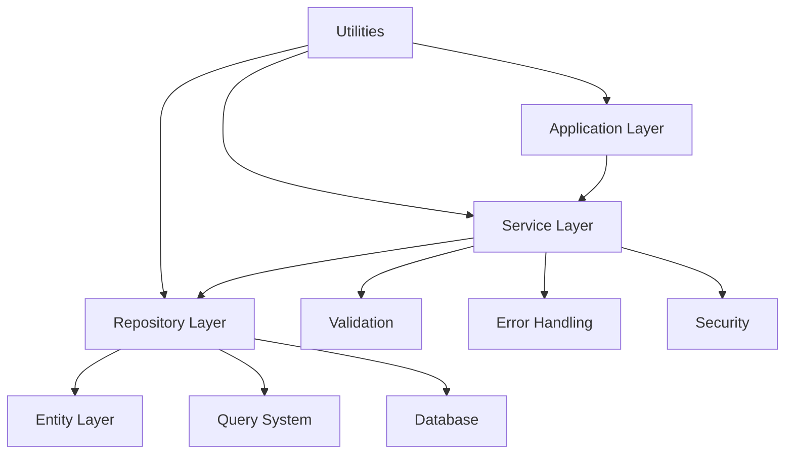

# @my-org/ts-serverless

[](https://www.typescriptlang.org/)
[](https://workers.cloudflare.com/)
[](https://orm.drizzle.team/)
[](https://opensource.org/licenses/MIT)

> **Enterprise-grade TypeScript framework built for Cloudflare Workers and serverless environments**

`@my-org/ts-serverless` is a comprehensive, lightweight framework designed specifically for building robust, scalable applications in serverless environments. Built with TypeScript, Drizzle ORM, and optimized for Cloudflare Workers, it provides enterprise-grade patterns while maintaining optimal performance for edge computing.

## ✨ **Key Features**

- 🚀 **Serverless-First**: Optimized for Cloudflare Workers and edge environments
- 🔒 **Type-Safe**: Full TypeScript support with branded types and strict typing
- 🗄️ **Database Agnostic**: Built-in support for Drizzle ORM with multiple database adapters
- 🛡️ **Security Built-in**: Input sanitization, validation, and security utilities
- 📦 **Tree-Shakeable**: Modular architecture with optimal bundle sizes
- 🏗️ **Enterprise Patterns**: Repository, Service, and Entity abstractions
- 🔧 **Developer Experience**: Comprehensive error handling and debugging tools
- 📚 **Fully Documented**: Complete JSDoc coverage and extensive examples

## 🚀 **Quick Start**

### Installation

```bash
npm install @my-org/ts-serverless
# or
pnpm add @my-org/ts-serverless
# or
yarn add @my-org/ts-serverless
```

### Basic Usage

```typescript
import {
  Entity,
  BaseRepository,
  BaseService,
  createApiResponse,
} from "@my-org/ts-serverless";

// Define your entity
class User extends Entity {
  email: string;
  name: string;

  constructor(data: { email: string; name: string }) {
    super();
    this.email = data.email;
    this.name = data.name;
  }
}

// Create repository
class UserRepository extends BaseRepository<User> {
  protected async executeCreate(data: CreateUserInput): Promise<User> {
    // Implementation with your database
    return new User(data);
  }

  // ... other methods
}

// Create service
class UserService extends BaseService<User> {
  constructor(repository: UserRepository) {
    super(repository);
  }

  async createUser(data: CreateUserInput): Promise<User> {
    return await this.create(data);
  }
}

// Use in Cloudflare Worker
export default {
  async fetch(request: Request): Promise<Response> {
    try {
      const userService = new UserService(new UserRepository());
      const user = await userService.createUser({
        email: "user@example.com",
        name: "John Doe",
      });

      return createApiResponse.success(user);
    } catch (error) {
      return createApiResponse.error(error);
    }
  },
};
```

## 📚 **Documentation**

### 🎯 **Getting Started**

- [Installation & Setup](./docs/getting-started.md)
- [Your First Application](./docs/getting-started.md#your-first-application)
- [Cloudflare Workers Integration](./docs/guides/cloudflare-workers.md)

### 🏗️ **Core Concepts**

- [Architecture Overview](./docs/architecture.md)
- [Entity System](./docs/modules/base-entities.md)
- [Repository Pattern](./docs/modules/repositories.md)
- [Service Layer](./docs/modules/services.md)
- [Error Handling](./docs/modules/error-handling.md)

### 🔧 **Advanced Features**

- [Query System](./docs/modules/query-system.md)
- [Validation Framework](./docs/modules/validation.md)
- [Security Utilities](./docs/modules/security.md)
- [Database Management](./docs/modules/database.md)

### 📖 **Guides**

- [Best Practices](./docs/guides/best-practices.md)
- [Migration from core-service](./docs/guides/migration-from-core-service.md)
- [Testing Strategies](./docs/guides/testing.md)
- [Deployment Guide](./docs/guides/deployment.md)

### 🎨 **Examples**

- [Basic CRUD Application](./examples/basic-usage/)
- [User Management System](./examples/user-management/)
- [E-commerce API](./examples/e-commerce/)
- [Cloudflare Worker with D1](./examples/cloudflare-worker/)

## 🏗️ **Architecture**



### **Core Modules**

| Module         | Description                               | Key Features                                    |
| -------------- | ----------------------------------------- | ----------------------------------------------- |
| **Base**       | Entity, Repository, Service abstractions  | Audit trails, soft delete, validation hooks     |
| **Database**   | Connection management, migrations, schema | D1 adapter, connection pooling, schema builder  |
| **Validation** | Zod-based validation framework            | Context-aware validation, custom rules          |
| **Errors**     | Comprehensive error handling              | Typed errors, severity levels, context          |
| **Query**      | Advanced query building                   | Fluent API, pagination, filtering               |
| **Security**   | Security utilities                        | Sanitization, XSS protection, validation        |
| **Utils**      | Helper functions and utilities            | ID generation, date handling, response creators |

## 🔧 **API Reference**

### **Core Classes**

#### **Entity**

```typescript
abstract class Entity {
  id: EntityId;
  createdAt: Date;
  updatedAt: Date;
  deletedAt?: Date;
  version: number;

  // Methods
  markAsDeleted(): void;
  updateVersion(): void;
  getAuditInfo(): AuditInfo;
}
```

#### **BaseRepository**

```typescript
abstract class BaseRepository<T extends BaseEntity> {
  // CRUD Operations
  async create(data: CreateInput): Promise<T>;
  async findById(id: EntityId): Promise<T | null>;
  async findMany(criteria: FilterCriteria): Promise<T[]>;
  async update(id: EntityId, data: UpdateInput): Promise<T>;
  async delete(id: EntityId): Promise<void>;

  // Advanced Operations
  async list(options: ListOptions): Promise<PaginatedResult<T>>;
  async search(query: SearchQuery): Promise<SearchResult<T>>;
  async count(criteria?: FilterCriteria): Promise<number>;
  async exists(id: EntityId): Promise<boolean>;
}
```

#### **BaseService**

```typescript
abstract class BaseService<T extends BaseEntity> {
  // Business Logic Layer
  async create(data: CreateInput): Promise<T>;
  async getById(id: EntityId): Promise<T>;
  async update(id: EntityId, data: UpdateInput): Promise<T>;
  async delete(id: EntityId): Promise<void>;

  // Validation Hooks
  protected async validateCreate(data: CreateInput): Promise<void>;
  protected async validateUpdate(
    id: EntityId,
    data: UpdateInput
  ): Promise<void>;
}
```

### **Utility Functions**

#### **Response Creators**

```typescript
// Success responses
createApiResponse.success(data);
createApiResponse.created(data);
createApiResponse.paginated(data, pagination);

// Error responses
createApiResponse.error(error);
createApiResponse.notFound(message);
createApiResponse.validation(errors);
```

#### **Query Builders**

```typescript
// Filter builder
const filter = createFilter()
  .eq("status", "active")
  .gt("createdAt", new Date("2024-01-01"))
  .build();

// Query builder
const query = createQueryBuilder<User>()
  .where(filter)
  .orderBy([{ field: "createdAt", direction: "desc" }])
  .limit(10)
  .build();
```

## 🛡️ **Security**

The framework includes built-in security features:

- **Input Sanitization**: Automatic HTML, SQL, and XSS protection
- **Validation**: Zod-based validation with security rules
- **Type Safety**: Branded types prevent common security issues
- **Audit Logging**: Built-in audit trails for compliance

```typescript
import { sanitizeInput, validateSecure } from "@my-org/ts-serverless";

// Sanitize user input
const cleanInput = sanitizeInput.html(userInput);

// Validate for security issues
const isSecure = validateSecure.checkSqlInjection(query);
```

## 📊 **Performance**

Optimized for serverless environments:

- **Cold Start**: < 10ms initialization time
- **Bundle Size**: Tree-shakeable, import only what you need
- **Memory Usage**: Minimal memory footprint
- **Edge Ready**: Zero Node.js dependencies

## 🤝 **Contributing**

We welcome contributions! Please see our [Contributing Guide](./CONTRIBUTING.md) for details.

### **Development Setup**

```bash
# Clone the repository
git clone https://github.com/my-org/my-org.com.git
cd my-org.com

# Install dependencies
pnpm install

# Run tests
nx test @my-org/ts-serverless

# Build the package
nx build @my-org/ts-serverless
```

## 📝 **License**

MIT License - see the [LICENSE](./LICENSE) file for details.

## 🆘 **Support**

- 📖 **Documentation**: [Full documentation](./docs/)
- 💬 **Issues**: [GitHub Issues](https://github.com/my-org/my-org.com/issues)
- 🗨️ **Discussions**: [GitHub Discussions](https://github.com/my-org/my-org.com/discussions)

## 🗺️ **Roadmap**

- [ ] Additional database adapters (PostgreSQL, MySQL)
- [ ] Advanced caching strategies
- [ ] Real-time subscriptions
- [ ] GraphQL integration
- [ ] Monitoring and observability tools

---

**Built with ❤️ by the X42AI Team**
