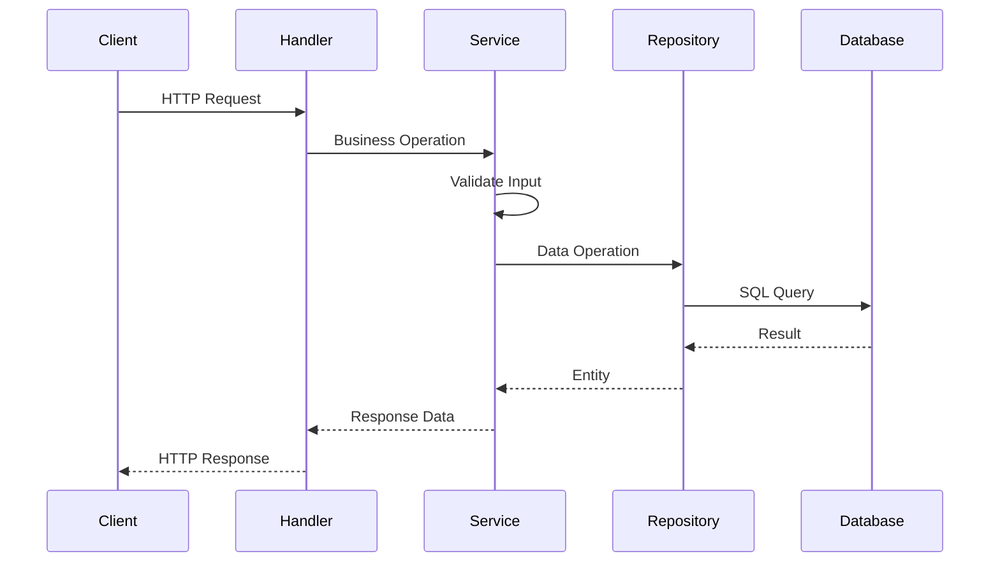
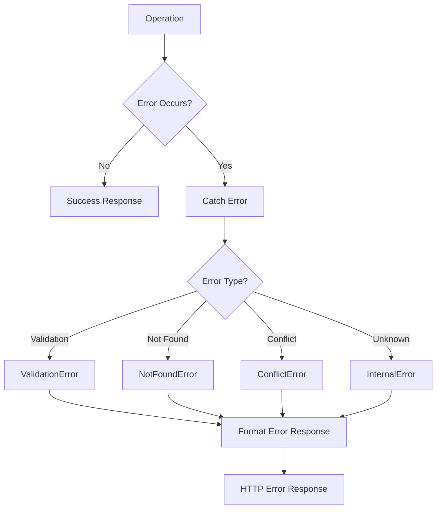
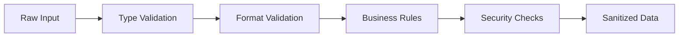

# Architecture Overview

The `@my-org/ts-serverless` is built on proven enterprise patterns adapted for serverless environments. This document explains the architectural decisions, design patterns, and how the various components work together.

## 🏗️ **Architectural Principles**

### **1. Serverless-First Design**

- **Stateless**: All components are designed to be stateless
- **Fast Cold Starts**: Minimal initialization overhead
- **Edge-Compatible**: Works in edge environments like Cloudflare Workers
- **Memory Efficient**: Optimized for limited memory constraints

### **2. Layered Architecture**

```
┌─────────────────────────────────────┐
│           Application Layer         │  ← HTTP handlers, API routes
├─────────────────────────────────────┤
│            Service Layer            │  ← Business logic, validation
├─────────────────────────────────────┤
│          Repository Layer           │  ← Data access, queries
├─────────────────────────────────────┤
│            Entity Layer             │  ← Domain models, business rules
├─────────────────────────────────────┤
│          Infrastructure             │  ← Database, external services
└─────────────────────────────────────┘
```

### **3. Dependency Inversion**

- High-level modules don't depend on low-level modules
- Both depend on abstractions (interfaces)
- Abstractions don't depend on details

### **4. Domain-Driven Design (DDD)**

- Entities represent business objects
- Services contain business logic
- Repositories handle data persistence
- Clear separation of concerns

## 🔧 **Core Components**

### **Entity Layer**

**Purpose**: Represent business objects and enforce business rules

```typescript
abstract class Entity {
  protected constructor(id?: EntityId) {
    this.id = id || generateId();
    this.createdAt = new Date();
    this.updatedAt = new Date();
    this.version = 1;
  }

  // Built-in audit trail
  public touch(): void {
    this.updatedAt = new Date();
    this.version += 1;
  }

  // Soft delete support
  public markAsDeleted(): void {
    this.deletedAt = new Date();
    this.touch();
  }
}
```

**Key Features**:

- Automatic ID generation
- Audit trails (created/updated timestamps)
- Version tracking for optimistic locking
- Soft delete support
- Business rule enforcement

### **Repository Layer**

**Purpose**: Abstract data access and provide a clean interface for data operations

```typescript
abstract class BaseRepository<T extends BaseEntity> {
  // Standard CRUD operations
  abstract create(data: CreateInput): Promise<T>;
  abstract findById(id: EntityId): Promise<T | null>;
  abstract update(id: EntityId, data: UpdateInput): Promise<T>;
  abstract delete(id: EntityId): Promise<void>;

  // Advanced operations
  abstract list(options: ListOptions): Promise<PaginatedResult<T>>;
  abstract search(query: SearchQuery): Promise<SearchResult<T>>;
  abstract count(criteria?: FilterCriteria): Promise<number>;
}
```

**Benefits**:

- Database-agnostic interface
- Consistent API across different entities
- Built-in pagination and filtering
- Soft delete handling
- Query optimization hooks

### **Service Layer**

**Purpose**: Implement business logic and coordinate between repositories

```typescript
abstract class BaseService<T extends BaseEntity> {
  constructor(protected repository: BaseRepository<T>) {}

  async create(data: CreateInput): Promise<T> {
    await this.validateCreate(data);
    return await this.repository.create(data);
  }

  // Validation hooks
  protected abstract validateCreate(data: CreateInput): Promise<void>;
  protected abstract validateUpdate(
    id: EntityId,
    data: UpdateInput
  ): Promise<void>;
}
```

**Responsibilities**:

- Input validation
- Business rule enforcement
- Transaction coordination
- Error handling
- Authorization checks

## 📊 **Data Flow**

### **Request Processing Flow**



### **Error Handling Flow**



## 🗄️ **Database Integration**

### **Connection Management**

```typescript
class ConnectionManager {
  private static instance: ConnectionManager;
  private connections: Map<string, DatabaseConnection> = new Map();

  public static getInstance(): ConnectionManager {
    if (!ConnectionManager.instance) {
      ConnectionManager.instance = new ConnectionManager();
    }
    return ConnectionManager.instance;
  }
}
```

**Features**:

- Singleton pattern for connection management
- Connection pooling (when supported)
- Health check monitoring
- Automatic cleanup

### **Schema Management**

```typescript
class SchemaBuilder {
  addTable(definition: TableDefinition): this;
  addIndex(definition: IndexDefinition): this;
  addConstraint(definition: ConstraintDefinition): this;
  build(): SchemaDefinition;
}
```

**Capabilities**:

- Programmatic schema definition
- Migration generation
- Validation and consistency checks
- Cross-database compatibility

### **Migration System**

```typescript
class MigrationManager {
  async migrate(): Promise<MigrationStatus[]>;
  async rollback(): Promise<MigrationStatus | null>;
  async getPendingMigrations(): Promise<Migration[]>;
}
```

**Features**:

- Forward and backward migrations
- Transaction-based execution
- Rollback capability
- Migration status tracking

## 🔍 **Query System**

### **Filter Builder**

```typescript
const filter = createFilter()
  .eq("status", "active")
  .gt("createdAt", new Date("2024-01-01"))
  .in("category", ["tech", "business"])
  .build();
```

### **Query Builder**

```typescript
const query = createQueryBuilder<User>()
  .where(filter)
  .orderBy([{ field: "createdAt", direction: "desc" }])
  .limit(10)
  .offset(20)
  .select(["id", "name", "email"])
  .build();
```

### **Pagination**

```typescript
const result = await repository.list({
  page: 1,
  limit: 10,
  filter: criteria,
  sort: [{ field: "createdAt", direction: "desc" }],
});
```

## 🛡️ **Security Architecture**

### **Input Sanitization**

```typescript
// Automatic sanitization
const cleanInput = sanitizeInput.html(userInput);
const safeQuery = sanitizeInput.sql(sqlQuery);
```

### **Validation Pipeline**



### **Authorization Framework**

```typescript
interface SecurityContext {
  userId?: UserId;
  tenantId?: TenantId;
  permissions: Permission[];
  roles: Role[];
}
```

## 🔧 **Error Handling Architecture**

### **Error Hierarchy**

```
BaseError
├── ValidationError
├── NotFoundError
├── ConflictError
├── UnauthorizedError
├── ForbiddenError
├── InternalError
└── Domain Errors
    ├── BusinessRuleError
    ├── ConcurrencyError
    └── InvariantViolationError
```

### **Error Context**

```typescript
interface ErrorContext {
  traceId: TraceId;
  userId?: UserId;
  operation: string;
  metadata: Record<string, unknown>;
  timestamp: Date;
}
```

## 📈 **Performance Considerations**

### **Memory Management**

- Object pooling for frequently created objects
- Lazy loading of optional dependencies
- Efficient serialization/deserialization

### **Cold Start Optimization**

- Minimal module initialization
- Conditional imports
- Precompiled validation schemas

### **Bundle Size Optimization**

- Tree-shakeable exports
- Modular architecture
- Optional dependencies

## 🔄 **Extensibility Patterns**

### **Plugin System**

```typescript
interface Plugin {
  name: string;
  version: string;
  install(framework: CoreFramework): void;
}
```

### **Custom Validators**

```typescript
interface CustomValidator<T> {
  validate(value: T, context: ValidationContext): ValidationResult;
}
```

### **Custom Error Types**

```typescript
class CustomBusinessError extends BaseError {
  constructor(message: string, context?: ErrorContext) {
    super(message, "CUSTOM_BUSINESS_ERROR", "error", context);
  }
}
```

## 🏭 **Production Considerations**

### **Monitoring**

- Built-in tracing with trace IDs
- Error context collection
- Performance metrics

### **Logging**

- Structured logging support
- Configurable log levels
- Sensitive data filtering

### **Configuration**

- Environment-based configuration
- Runtime configuration updates
- Feature flags support

## 🔮 **Future Architecture**

### **Planned Enhancements**

- Event sourcing support
- CQRS pattern implementation
- Real-time subscriptions
- GraphQL integration
- Advanced caching strategies

### **Scalability Roadmap**

- Multi-tenant architecture
- Distributed caching
- Event-driven architecture
- Microservices support

This architecture provides a solid foundation for building enterprise-grade serverless applications while maintaining simplicity and performance.
